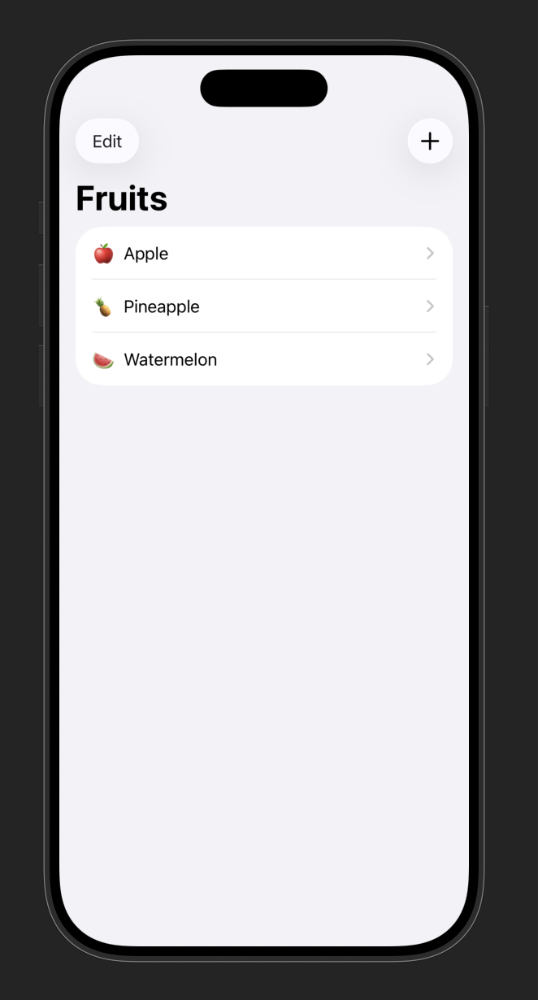
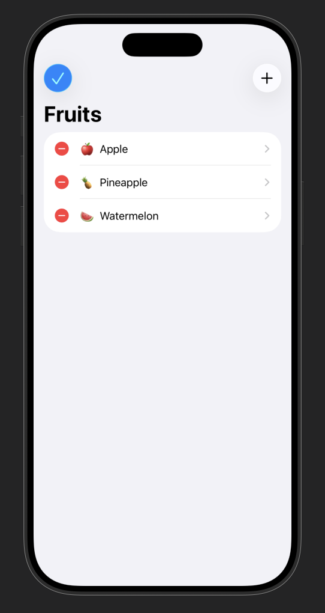
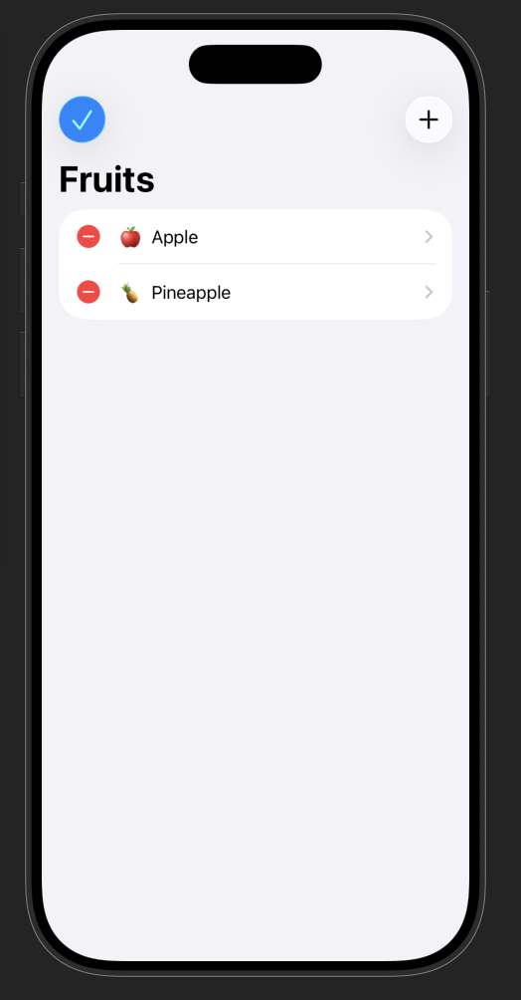
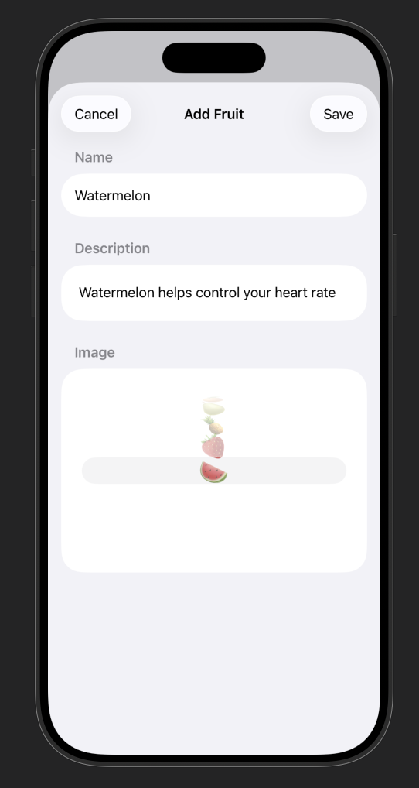
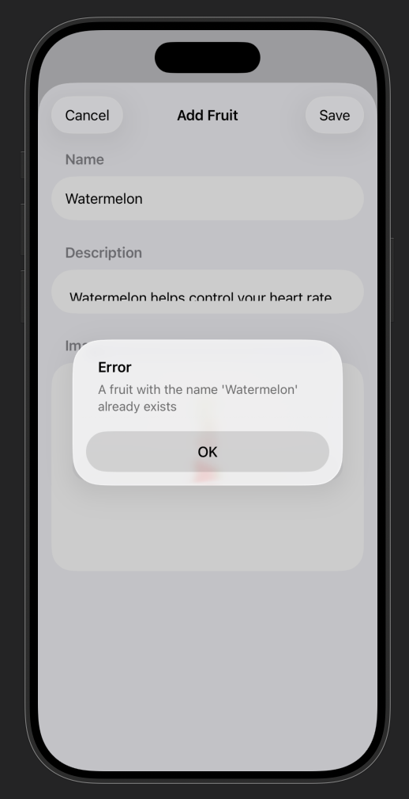
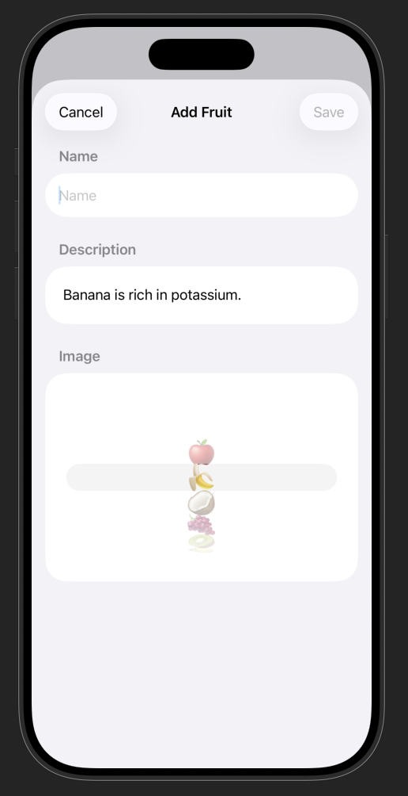
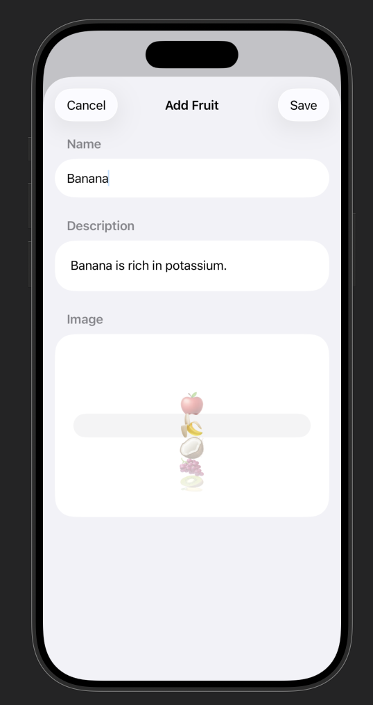
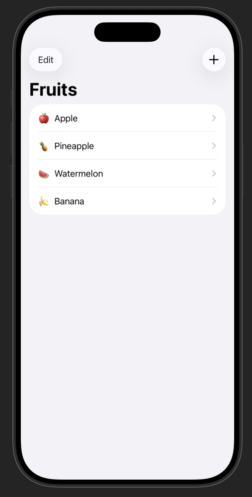

# 🍉 FruitsDemo – Resultat  
**Autors:** *Mariona Arenillas & Evelyn Aguayo*

Aquest projecte mostra una aplicació senzilla per gestionar fruites mitjançant:

- Visualització de fruites
- Navegació entre pantalles
- Afegir noves fruites amb validacions
- Eliminar fruites existents

---

## 🏠 Pantalla inicial

A la pantalla principal podem:

- **Veure** totes les fruites creades  
- Accedir al mode **Edit** per eliminar fruites  
- **Afegir** una nova fruita amb el botó **+**

---

## 🗑️ Mode Edit – Eliminar fruites

En prémer **Edit**, es poden seleccionar fruites i eliminar-les fàcilment.

  

---

## ➕ Afegir una nova fruita

La pantalla d’alta permet introduir:

- Nom de la fruita  
- Emoji  
- Descripció  

### 🔍 Validacions incorporades

#### 1️⃣ Fruita duplicada  
Si intentem afegir una fruita **ja existent**, l’aplicació mostra un missatge d’error:

#### 2️⃣ Nom obligatori  
Si el camp *name* està buit, el botó **Save** queda deshabilitat:

---

## 💾 Guardar i tornar a la pantalla inicial

Quan premem **Save** amb totes les dades correctes, la fruita es guarda i apareix a la pantalla principal:

  

